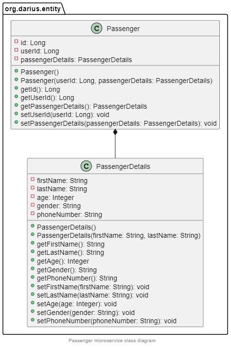
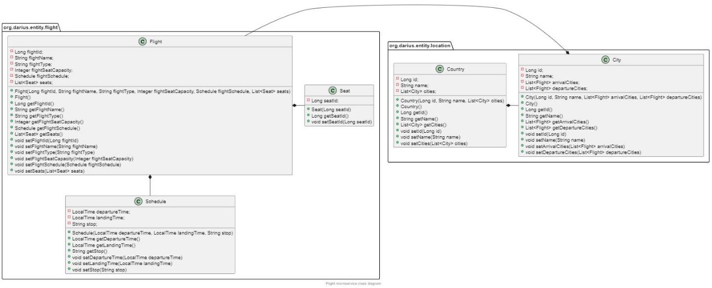
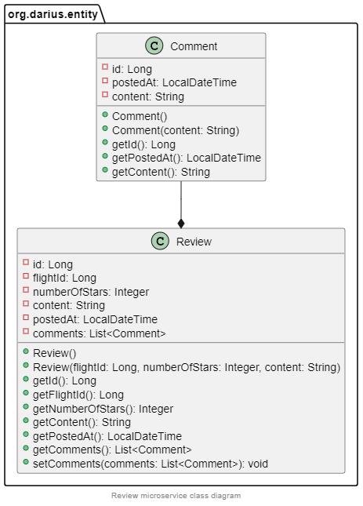
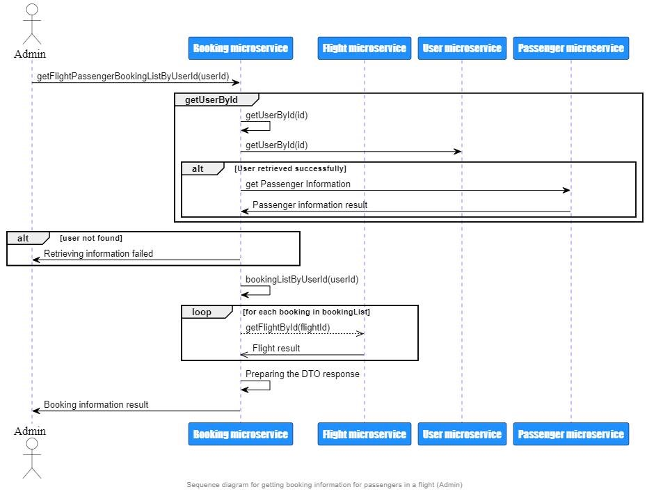
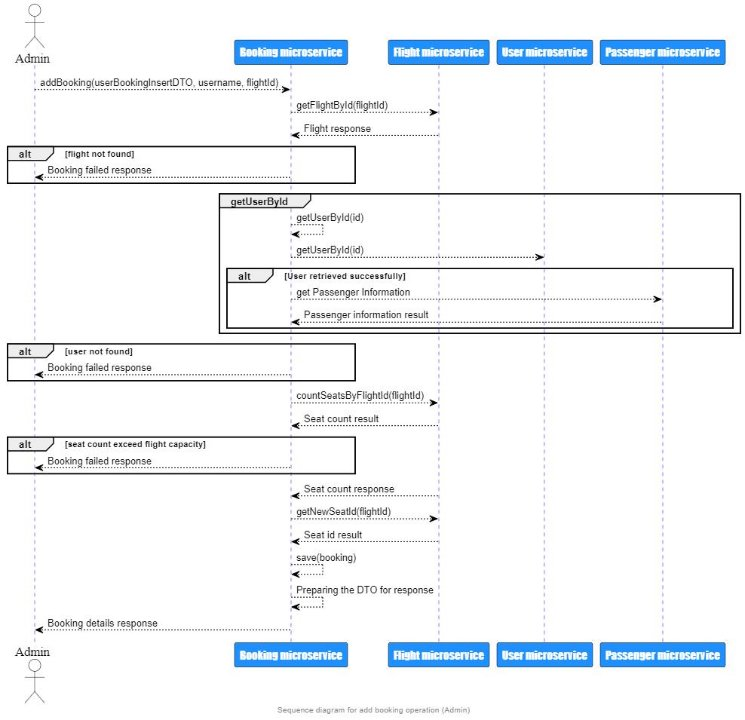

Capstone Project Flight management System

Darius-Nicolae Litescu

2022

Structure

1. General information
1. UML Diagrams
- 2.1 Use Case
- 2.2 Component
- 2.3 Class
- 2.4 Sequence

1\. General information

- The Flight Management System has an API that can be used to manage flights and passengers. An airline may use the system to keep track of their flights and passenger data.
- The system provides the ability to add, delete, or update flights. It also allows someone to access booking information and history. 
- Customers may use the API's search feature to discover information about flights, such as the departure and arrival cities. Customers are also able to provide comments and feedback on their trip.
- The system is based on a microservices architecture, and it is accessible via a REST API with JSON for data transmission.
1. Use Case Diagrams
- Use Case diagrams are excellent way to give a high-level overview of a system's capabilities. It can also be used to identify the key actors in a system and their interactions.

Login (User) Microservice Use Case Diagram

Passenger Microservice Use Case Diagram

Flight Microservice Use Case Diagram

Booking Microservice Use Case Diagram

Review Microservice Use Case Diagram

2. Component Diagram
- The Component Diagram is used to understand how a system's individual components interact with each other.

3. Class Diagrams
- Class Diagrams are used to understand a system's static structure.

Class diagram for Login and Passenger  microservices 

Class diagram for Flight Microservice

Class diagram for Booking and Review  Microservices 

2\.1.3 Sequence Diagrams

- Sequence Diagrams allow you to see how individual operations are executed.

